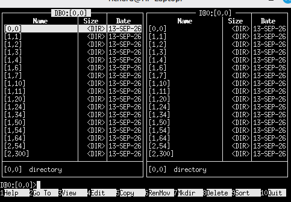

# NC - Norton Commander for RSX-11M-PLUS

NC is a two panel file manager for RSX-11M-PLUS, modelled on Norton
Commander. It runs on VT100 compatible terminals. The program is
written in Oregon Software Pascal-2, with a small MACRO-11 module for
system services. Building and installation are described in BUILD.md.

    >RUN DB0:[NC]NC

On entry the left panel shows the terminal's default directory and
the right panel shows the master file directory, [0,0], of the same
volume.

## The screen

The active panel is the one with the highlighted title and the cursor
bar. Sizes are in blocks, as reported by PIP /LI. Files of 32,768
blocks or more are shown in units of 1,024 blocks, for example 52K.
The date and time are the creation date and time from the file header.
On an 80 column screen the time appears on the information line. On a
132 column screen each panel has a time column.

Directories are listed by their UIC or name, as [1,54] or [PAS]. Every
directory except the MFD begins with an entry "..", which returns to
[0,0]. The information line at the foot of each panel describes the
file under the cursor. A C at the right hand end marks a contiguous
file. When files are selected, the line shows how many there are and
their total size instead.

Below the panels is the command line, with the key legend under it.

## Keys

Cursor movement:

    Up, Down            One line
    Prev, Next          One page (PgUp, PgDn on a PC keyboard)
    Left, Right         One page
    Find, Select        First or last entry (Home, End)
    TAB                 Other panel

RETURN acts on the entry under the cursor. On a directory it opens
the directory, and on ".." it returns to the MFD. A task file (.TSK)
is run with RUN, and an indirect command file (.CMD) is executed with
@. Any other file is displayed in the viewer. If anything has been
typed on the command line, RETURN executes the command instead.

Selection:

    Insert Here, CTRL/T  Select or deselect the file, move down
    +                    Select all files
    -                    Deselect all files
    *                    Invert the selection

The +, - and * keys only have this meaning while the command line is
empty.

Function keys:

    F1    Help
    F2    Choose a device, or go to a directory
    F3    View file
    F4    Edit file with EDT
    F5    Copy
    F6    Rename or move
    F7    Create directory
    F8    Delete
    F9    Sort order; colour on or off
    F10   Exit

A VT100 has no F5 to F10 keys. On a VT100, PF1 to PF4 serve as F1 to
F4. On any terminal, ESC followed by a digit may be used instead:
ESC 1 for F1 through ESC 0 for F10.

Other keys:

    CTRL/F              Copy the file name to the command line
    CTRL/R              Re-read the directory
    CTRL/L              Redraw the screen
    CTRL/U              Exchange the two panels
    ESC ESC, CTRL/C     Clear the command line
    DELETE, BACKSPACE   Delete the last character

## Devices and directories

F2 lists the mounted Files-11 volumes, with the active panel's device
highlighted:

    DU0:    SY: LB:  Left Right
    DU1:
    DY0:
    Type a path...

SY: and LB: are marked, as are the devices shown in the left and right
panels. Move with the cursor keys and press RETURN to show the MFD of
the chosen device in the active panel. ESC or F2 closes the list
without changing anything.

To go to a particular directory, choose "Type a path..." or simply
start typing. A path may be given as DDn:[dir], DDn: or [dir]. A
directory without a device is looked up on the active panel's device.
Unit numbers are octal. Pseudo devices such as SY: and LB: are
accepted and resolved to the physical device. If the device or
directory cannot be read, the panel is left where it was.

Each panel has its own device, so files can be copied or moved
between volumes by showing one in each panel.

## Commands

Anything typed that is not one of the keys above goes on the command
line. RETURN passes the line to MCR. The screen is cleared while the
command runs. When it finishes, NC waits for a key so that the output
can be read, then redraws the panels. An exit status other than
success is displayed.

Commands are executed in the directory shown in the active panel. To
arrange this NC issues SET /DEF for that directory before the command.
The terminal's default directory therefore follows the active panel,
and is left wherever it was last when NC exits. Commands are always
given to MCR, whichever CLI the terminal is set to.

## File operations

Copy, rename, delete and create directory are all carried out by
spawning PIP or UFD through MCR. Each command line is displayed as it
runs. If any of them fails, NC waits for a key before redrawing so
that the error message can be read. The operations apply to the
selected files, or to the file under the cursor if none is selected.

F5 copies to the directory in the other panel. The destination is
offered for editing first. If no device is given, the device of the
active panel is used. If neither device nor directory is given, the
destination is taken as a file name in the active panel's directory.
Each file is copied with

    PIP ddn:[dest]/NV=ddn:[dir]NAME.TYP;v

so the copy receives the next free version number.

F6 renames or moves. On the same device it uses PIP /RE:

    PIP ddn:[dest]NAME.TYP;v/RE=ddn:[dir]NAME.TYP;v

To another device the file is copied as for F5, and the original is
deleted only if the copy succeeded. To rename a single file, replace
the destination with the new name, for example NEWNAME.PAS.

F7 creates a directory with UFD. Give the directory as [g,m] or
[NAME].

F8 deletes, after asking for confirmation, with PIP /DE. Directory
files are skipped. They must be deleted with PIP.

F4 runs EDT on the file under the cursor. EDT starts in line mode.
Type C for screen editing, and EXIT or QUIT to return to NC.

## Messages

While it runs, NC sets its terminal to refuse broadcast messages, as
SET /NOBRO would. The previous setting is restored on exit.

This does not help on the system console. The console logger writes
system messages, such as logins and logouts, directly to the console
terminal, and they cannot be refused. If NC is used on the console,
press CTRL/L to redraw after a message. Alternatively, stop the
logger writing to the console terminal:

    >SET /COLOG/NOCOTERM

The messages are still recorded in LB:[1,4]CONSOLE.LOG. SET
/COLOG/COTERM restores output to the console, and SET /COLOG shows the
current state.

## Restrictions

Only the first 250 entries of a directory are shown. The F2 list
holds at most 24 devices, and only units 0 to 7 are looked for; a
volume on a higher unit is listed only while a panel shows it, but can
always be reached by typing its name. Command lines are
limited to 76 characters. The viewer displays the first 512 characters
of each record. The screen may be 80 to 132 columns wide and 16 to 66
lines long.

## Updating NC

To replace an older NC with a new release, copy the new NC.PAS and
NCIO.MAC into DB0:[NC] as described in BUILD.md. They are given the
next version numbers, so the old sources are kept. Then rebuild:

    >SET /DEF=DB0:[NC]
    >@NCMAKE

RUN DB0:[NC]NC always takes the highest version of NC.TSK, so nothing
more is needed if NC is only run that way.

If NC is installed, the installed copy is still the old task image
and must be replaced. First check that nobody is running NC; ACT /ALL
lists the active tasks. Then, from a privileged account:

    >TAS ...NC
    >REM ...NC
    >INS DB0:[NC]NC/TASK=...NC

TAS shows whether NC is installed. If it is not, TAS reports "Task
not in system" and the REM can be left out.

An INS lasts only until the system is next booted. To have NC
installed at every boot, put the same INS line in the system startup
procedure. On a standard system the place for it is
LB:[1,2]USERPROG.CMD, which STARTUP.CMD runs near its end:

    INS DB0:[NC]NC/TASK=...NC

Give no version number in this line. The newest NC.TSK is then
installed at boot, and the line does not have to be changed after
each update. If the startup procedure already installs NC, leave it
as it is.

When the new version has been checked, the old files can be removed:

    >PIP DB0:[NC]*.*/PU

## Implementation notes

NC.PAS contains the user interface and all the file handling logic.
NCIO.MAC contains the routines that need system services. They follow
the Pascal-2 calling conventions, using the macros in
[PAS]PASMAC.MAC.

Terminal input is read a character at a time with IO.RLB, with the
TF.RAL and TF.RNE subfunctions (read pass-all, no echo). Escape
sequences are assembled in the Pascal procedure GETKEY. Output is
collected in a 1,024 byte buffer and written with IO.WLB!TF.WAL, so
that the driver neither interprets the escape sequences nor wraps the
lines. Moving the cursor rewrites only the two lines concerned. The
panels are redrawn in full only after dialogues, commands and
directory changes. The screen size comes from SF.GMC (TC.WID and
TC.LPP), and broadcasts are refused through TC.NBR.

Directories are read with the ACP wildcard lookup IO.FNA, one entry
per QIO. The filename block passed in P6 has N.DID set to the
directory's file ID and N.STAT set to NB.SNM!NB.STP!NB.SVR. N.NEXT is
zero on the first call and is advanced by the ACP. P1 must be zero;
otherwise the ACP returns IE.BAD. The lookup ends with IE.NSF. The
MFD has file ID 4,4. Directory [g,m] is the MFD entry gggmmm.DIR, and
a named directory [NAME] is NAME.DIR.

File sizes and dates are obtained only when needed. That means for
the entries on the screen, or for all entries when sorting by size or
date. They are read with IO.RAT, attribute -10 (the complete file
header), with P1 pointing at the file ID. The file does not have to
be accessed. The size is F.EFBK, less one if F.FFBY is zero. The
creation date and time are I.CRDT and I.CRTI in the ident area. The
year in I.CRDT is held as two characters counted from 1900, the first
running on past 9 in ASCII, so that 2026 is stored as "<6".

RAD50 collates as space, A-Z, $, ., %, 0-9, which does not give the
order a user expects. NC holds each name word re-coded with the order
space, $, ., %, 0-9, A-Z. An unsigned comparison of these words then
sorts in ASCII order, and they are decoded directly for display.

There is no directive that lists mounted volumes to a nonprivileged
task, so the F2 list is found by trial. For each of the disk device
names DB, DD, DF, DK, DL, DM, DP, DR, DS, DT, DU, DW, DX, DY, DZ and VD,
units 0 to 7 are assigned to LUN 15 with ALUN$. A unit that does not
exist fails with IE.IDU. For one that does, GLUN$ gives the physical
device, so a redirected device is listed once under its target. The
unit is listed if the MFD header (file ID 4,4) can be read with
IO.RAT; the QIO fails at once on a volume that is not mounted, or is
mounted foreign. The scan is repeated each time F2 is pressed.

The viewer opens files by file ID with FCS OFID$R and reads them with
GET$. It uses a VT100 scrolling region, so moving forward one line
costs one record read. Moving backward re-opens the file and reads
forward to the required line.

Commands are run by spawning MCR... with SPWN$ and waiting for the
exit status with WTSE$. The terminal is detached while the command
runs. The Pascal-2 run-time system attaches the terminal, and if it
stayed attached, output from the spawned task would be held until NC
exited.

Resources used:

    LUN 13    Viewer file (FCS)
    LUN 14    Terminal
    LUN 15    Directory and file header QIOs
    EFN 22    Terminal I/O
    EFN 23    File system I/O
    EFN 24    Spawned command
